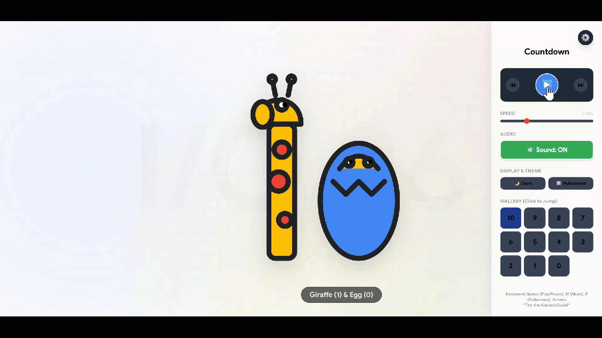

# 🦒 Animal Countdown — Google I/O 2026

> A joyful 11-second countdown where animals **become** 
> the numbers. Built for the [Code the Countdown](https://io.google/2026/codethecountdown) 
> challenge.


---

## ✨ The Idea

What if numbers were alive?

Each digit from **10 down to 0** is formed by a 
different animal posing in the shape of that number. 
A giraffe stretches into a "1". A seahorse curls into 
a "5". A penguin stands proudly as a "1". 

It's a children's picture book come to life — built 
entirely with Gemini Canvas in a single HTML file.

## 🎬 Demo

📹 **[Watch the 18s YouTube demo video](https://youtu.be/Z84kXKk6c4Y)**
🔗 **[Live Demo without sound in gif](https://github.com/leewalter/CodeTheCountdown-IO2026/blob/main/countdown-IO-26.gif)**  
🔗 **[Live Demo with sound in mp4](https://github.com/leewalter/CodeTheCountdown-IO2026/blob/main/countdown-IO-26.mp4)**  




## 🐾 The Cast

| Number | Animal | Pose |
|--------|--------|------|
| **10** | 🦒 Giraffe + 🥚 Egg | Tall neck + cracked egg |
| **9**  | 🐵 Monkey | Hanging by tail, body curled |
| **8**  | 🦉 Owls | Two stacked owls |
| **7**  | 🦩 Flamingo | One leg + bent neck |
| **6**  | 🐘 Elephant | Curled trunk |
| **5**  | 🐴 Seahorse | Natural curl |
| **4**  | 🦘 Kangaroo | Mid-jump pose |
| **3**  | 🐛 Caterpillar | Curled fat body |
| **2**  | 🦢 Swan | Elegant neck |
| **1**  | 🐧 Penguin | Standing tall |
| **0**  | 🐭🐰🦔 Friends | Ring of animals → I/O 26 logo |

## 🎨 Design

- **Palette**: Google Blue / Red / Yellow / Green
- **Typography**: Google Sans Display
- **Style**: Cartoon outline, soft shadows, breathing 
  motion
- **Audio**: Cheerful ukulele loop + animal SFX
- **Background**: Flowing I/O 2026 gradient mesh

## 🎮 Features

- ▶️ Full playback controls (play/pause/restart/scrub)
- ⚡ Speed control (0.5x → 2x)
- 🔊 Toggleable music + SFX
- 🎨 Light / dark mode
- 🐾 Animal gallery — preview any number instantly
- 📸 Built-in GIF/MP4 recorder
- ⌨️ Keyboard shortcuts (Space, R, ←/→, M, F, 0–9)
- 🥚 Konami-code Easter egg (↑ ↑ ↓ ↓ ← → ← → B A)

## 🛠️ Built With

- **Gemini Canvas** — generated the prototype
- Vanilla JS + SVG + Canvas 2D
- [anime.js](https://animejs.com) — timeline easing
- [Howler.js](https://howlerjs.com) — audio
- Google Fonts

## 🚀 Run Locally

```bash
git clone https://github.com/leewalter/CodeTheCountdown-IO2026
cd CodeTheCountdown-IO2026
open index.html
```

That's it. One file. Zero build step.

## 📜 License

MIT — go make something joyful.

---

Built with ❤️ by Walter Lee (GDE) for **Google I/O 2026**.  
*See you in the front row on May 19. 🎉*
